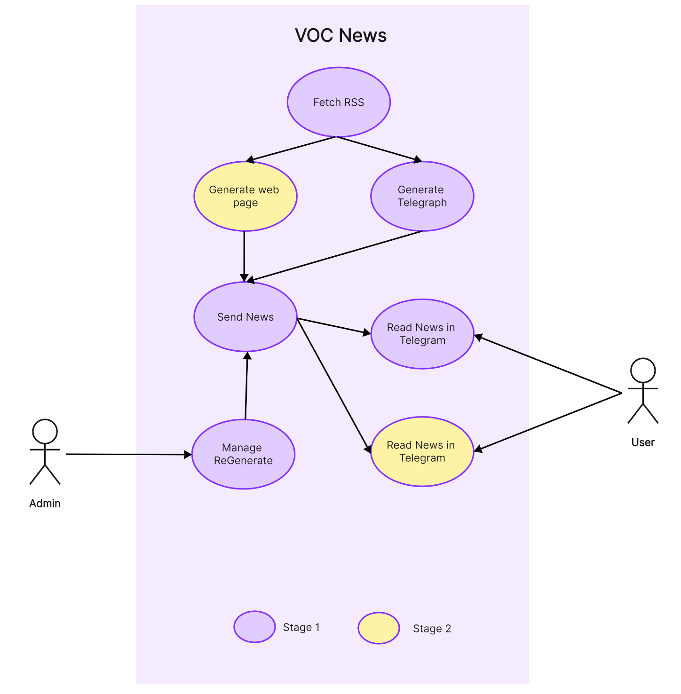
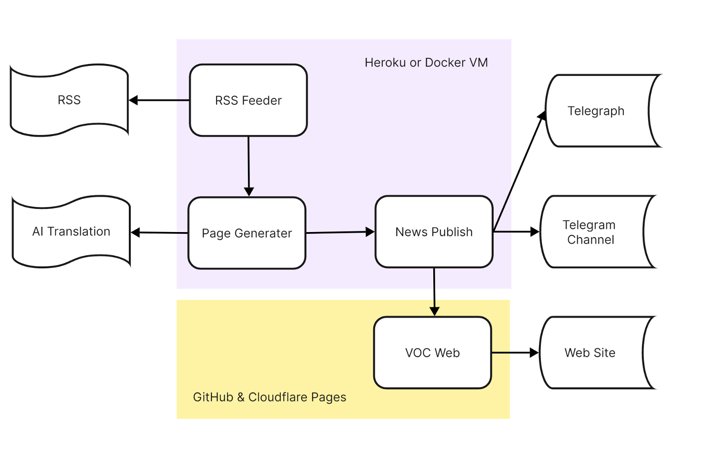

# VOCNews

## Project description

This project will complete a news site like this one for Chinese people, it will have a front end that uses Gatsby and React to display news. There won't be a full backend, but there will be a service that gets news via RSS, translates it into Chinese, and updates the news site through a publishing system.

## Technologies used

- Front end: Gatsby, React, Tailwindcss
  - Telegram: Share news to the Telegram channel
  - Telegram Bot: Monitor the operation of the system
- Back end: Nodejs
  - Python: News crawling, content analysis, translation, publishing
  - requests: Get news list from RSS
  - feedparser: Parse RSS
  - BeautifulSoup: Extract news content
  - lxml: Parse HTML
  - lxml-html-clean: Clean HTML
- Cloud service: Cloudflare Pages, Cloudflare Images, Cloudflare Function
  - MongoDB: Store news list
  - Doppler: Store environment variables and secrets
  - OpenAI or Ollama: use GPT 3.5 or QWen2 7b to translate news content
  - Telegraph: Publish news content
- CI/CD: React Testing Library, jest
  - pytest: Test the Python code 
  - GitHub Actions: CI
  - PDM: Python package management

## Special features

- [x] Get news list from RSS
- [x] Store news list to MongoDB and get updated news list
- [x] Analyzing news content and extracting reading views through crawlers
- [x] Translate news content into Chinese with OpenAI or Ollama's local LLM
- [x] Convert HTML to Telegraph format and publish to Telegraph
- [ ] Publish news to the Telegram channel
- [ ] Fully automated updating and operation
- [ ] Share to social media can be friendly to display content
- [ ] Automatic posting to websites and Telegram channels
- [ ] Telegram Bot allows you to monitor the operation of your system

## Use Case

## System Architecture

